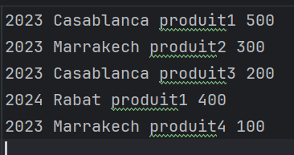
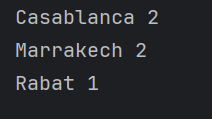
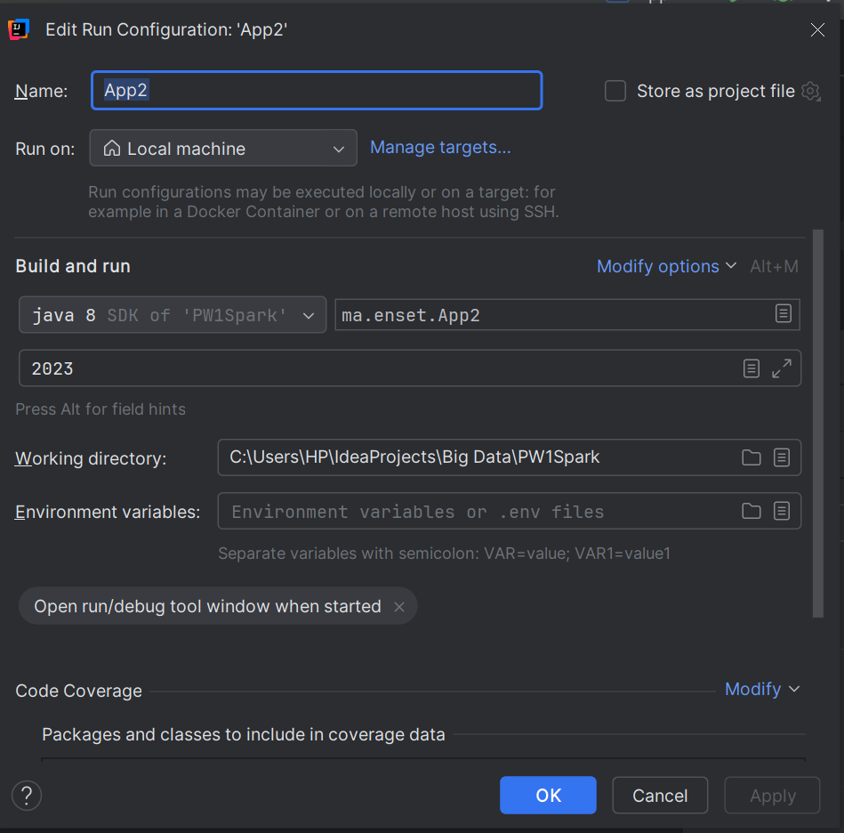
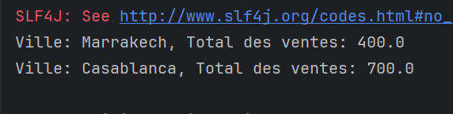
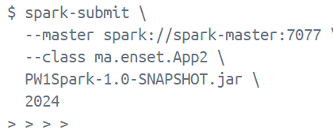
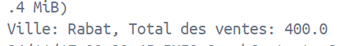
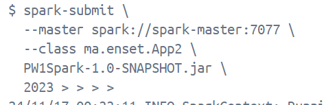
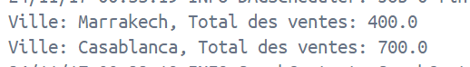

# Analyse des Ventes avec Apache Spark

Ce projet implémente deux applications Spark permettant d'analyser les ventes d'une entreprise à partir d'un fichier texte (`ventes.txt`). Les applications permettent de :

1. **Calculer le total des ventes par ville.**
2. **Calculer le prix total des ventes des produits par ville pour une année donnée.**

## Structure du Fichier d'Entrée (`ventes.txt`)

Le fichier contient des données de vente avec la structure suivante :


## Prérequis

- **Apache Spark** installé en local ou accessible via un cluster.
- **Scala** ou **Python** (selon le choix du langage pour Spark).
- Un environnement configuré pour exécuter des jobs Spark.

## Instructions

### 1. Application 1 : Calcul du Total des Ventes par Ville

#### Fonctionnalité
Cette application lit les données du fichier `ventes.txt` et calcule le total des ventes par ville.


#### Commande pour exécuter en Docker
```bash
spark-submit --master spark://spark-master:7077
--class ma.enset.Main
PW1Spark-1.0-SNAPCHOT.jar
````
### 2. Application 2 : Calcul du Total des Ventes des Produits par Ville pour une Année Donnée

#### Fonctionnalité
Cette application permet de calculer le total des ventes des produits par ville pour une année spécifiée.



#### Commande pour exécuter en docker
```bash
spark-submit --master spark://spark-master:7077
--class ma.enset.App2
PW1Spark-1.0-SNAPCHOT.jar
2024
````






